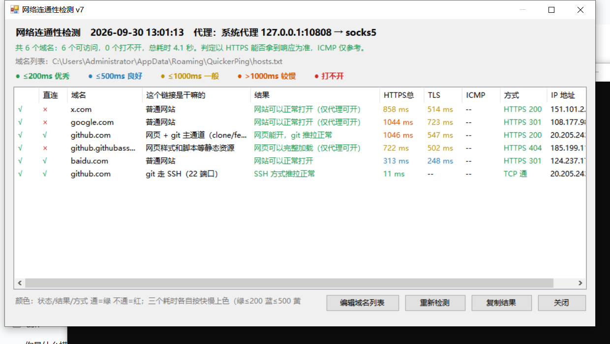

# Quicker 动作：网站连通性检测 v7（HTTPS 判定 · 自动代理 · 直连对照）

点一下动作 → 真去请求一遍 HTTPS，判断**能不能打开**、**要等多少 ms**、**这个链接是干嘛的**。

> 版本看窗口标题：当前 **v7**。标题没版本号、或「域名」列出现 `tcp/xxx` 这种带前缀的名字、或第一列又出现彩色文字 → 你导入的是旧动作。

## 文件

| 文件 | 用途 |
| --- | --- |
| [网站连通性检测.json](网站连通性检测.json) | 导入 Quicker 用的动作文件 |
| [PingCheck.cs](PingCheck.cs) | 「运行C#代码」步骤源码 |
| [github端点预设.txt](github端点预设.txt) | git/GitHub 端点清单，整段贴进 hosts.txt 即可 |
| [编辑域名列表.bat](编辑域名列表.bat) | 双击打开域名配置 |
| [效果图-github.png](效果图-github.png) | 实际运行截图 |

## 界面说明（v5 改动）

| 列 | 含义 | 颜色规则 |
| --- | --- | --- |
| **状态**（表头空） | **本次实际走的那条路**能不能打开（表头「代理：…」写了走的是哪条），只显示 `√` / `×` | 能连=**绿 √**，不能连=**红 ×** |
| **直连** | **不走代理**时的对照结果 | `√`=直连也能开（绿），`×`=只有走代理才能开（红），`–`=没测 |
| 域名 | 你配置的名字 | 黑 |
| **这个链接是干嘛的** | 该端点的用途（GitHub 端点内置中文说明） | 黑 |
| **结果** | 人话结论：通了会怎样 / 不通会怎样 | 通=**绿**，不通=**红** |
| HTTPS总 | 全流程耗时（连接+TLS+首字节）≈ 打开要等多久 | 按各自数值：绿≤200 蓝≤500 黄≤1000 橙>1000 |
| TLS | TLS 握手耗时（走代理时含代理建连到目标的时间） | 同上，无值=黑 |
| ICMP | ping 参考延迟 | 同上，无值=黑 |
| 方式 | HTTPS 200 / TCP 通 / TLS 失败 / 代理失败 … | 成功=绿，失败=红 |
| IP 地址 | 对端 IP | 黑 |

- **不再整行同色**：每个单元格按自己的值判断颜色，没有判断值的默认黑色。
- v6 起表格改成**自绘单元格**（不再依赖 ListView 自带的 subitem 着色），所以「状态」列不会再被耗时颜色串色，列的显示完全由色表决定。
- 「连接」列已去掉（走代理时它只是"连本地代理"的耗时，参考价值低，TLS 那一列已经包含真实网络耗时）。
- 失败色用的是**红**：因为"黄"已经被"一般(≤1000ms)"占用，再用黄会分不清"慢"和"不通"。想改成黄，把 `PingCheck.cs` 里 `badColor` 那一行的 `203,45,45` 改成 `191,143,0` 即可。

## 每个链接是干嘛的（内置说明）

GitHub 相关端点程序内置信中文说明，直接列域名就会显示；例如：

| 端点 | 用途 | 通了 | 不通 |
| --- | --- | --- | --- |
| `github.com` | 网页 + git 主通道（clone/fetch/push） | 网页能开，git 推拉正常 | 网页和 git 全部不可用 |
| `api.github.com` | API / 令牌校验 / 设备码登录 | 认证和 API 正常，推送不会反复要登录 | 推送可能反复要求登录或报错 |
| `codeload.github.com` | 下载 zip / tar.gz | 源码包可以正常下载 | 下载源码包会失败 |
| `raw.githubusercontent.com` | raw 文件 | raw 链接可以正常打开 | raw 链接打不开 |
| `objects.githubusercontent.com` | Release 附件 / LFS 对象 | 附件和 LFS 可以正常拉取 | 附件 / LFS 拉取失败 |
| `github.githubassets.com` | 网页样式和脚本等静态资源 | **网页可以完整加载** | **网页加载不全（样式、脚本缺失）** |
| `tcp/github.com:22` | git 走 SSH（22 端口） | SSH 方式推拉正常 | SSH 方式不可用（22 被封或代理不支持） |
| `tcp/ssh.github.com:443` | git 走 SSH over 443 | SSH over 443 可用 | SSH over 443 也不可用 |

自定义（其它域名）可以写成：

```
x.com | 社交网站 | 可以刷 X | X 打不开
```

即 `域名 [显示名] | 用途 | 通了的说明 | 不通的说明`，写了就覆盖内置文案；不写就用内置表，内置表里没有的域名会显示通用的"可以正常访问 / 打不开"。

## 「我明明没开代理，为什么显示能连？」（v7 直连对照）

因为**表头写了走的是哪条路**：`代理：系统代理 127.0.0.1:10808 → socks5` = 这次是**走你本机 10808 的代理**测的。代理软件只要在后台跑着、10808 通，动作就会用它（这正对应"浏览器开了代理"的情况）；而你浏览器没走代理，直连当然打不开——这两件事不矛盾。

v7 的「直连」列就是为了让这件事一眼可见：

| 你看到 | 含义 |
| --- | --- |
| 状态 √ + 直连 √ | 走代理能开，直连也能开 |
| 状态 √ + 直连 × | **只有走代理能开**（浏览器不开代理就打不开）→ 结果列会写「（仅代理可开）」 |
| 状态 × + 直连 √ | 代理这路不通，直连反而能开 |
| 状态 × + 直连 × | 两条路都不通 |

想要"浏览器没开代理时的真实情况"，两种办法：

1. 看「直连」列（v7 默认就测，`direct_check=on`）；
2. 或者干脆 `proxy=direct`，整个表就全是直连结果。

## 判定逻辑

| 层 | 通过条件 | 失败显示 |
| --- | --- | --- |
| DNS | 能解析 | DNS 失败 |
| TCP | 端口能连上 | TCP 失败 |
| **TLS + HTTP** | 握手成功 + `GET /` 拿到状态码（200/301/403/404…都算通） | **TLS 失败** |
| （`tcp/` 前缀） | 端口能连上就算通 | TCP 失败 |

- TLS 固定用 **TLS 1.2/1.1/1.0** 握手；失败会自动重连一次，再换系统默认协议（含 TLS1.3）重试一次。
- 每个域名最多试 3 个解析出来的 IP。
- ICMP（ping）只作参考：**ping 通不代表能打开**，ping 不通也不代表打不开（ICMP 不走代理）。

## 代理：默认 auto

```
proxy=auto                        默认。先读系统代理(注册表，不看 ProxyEnable 开关)，不通就扫本机常见端口，自动识别 SOCKS5/HTTP
proxy=direct                      强制直连
proxy=socks5://127.0.0.1:10808    指定 SOCKS5（v2rayN 默认端口）
proxy=http://127.0.0.1:10809      指定 HTTP 代理
```

扫描端口：`10808 10809 7890 7891 7897 1080 8889 8888 2080 20171 1081`。窗口表头会写明实际走的哪条路，例如 `代理：系统代理 127.0.0.1:10808 → socks5`。

## 配置项

```
proxy=auto          代理（见上）
icmp=off            关掉 ping（只测 HTTPS，快 5~7 倍）
direct_check=on     走代理时额外测一遍直连做对照（关掉更快）
direct_timeout=3000 直连对照的超时(毫秒)
timeout=1200        单次 ping 超时(毫秒)
http_timeout=6000   HTTPS 连接/读取超时(毫秒)
tries=2             每个域名 ping 次数
```

## 实测（本机，proxy=auto → socks5 10808）



```
[√] github.com            总 654 ms  TLS 451 ms  HTTPS 200   网页能开，git 推拉正常
[√] api.github.com        总 646 ms  TLS 441 ms  HTTPS 200   认证和 API 正常，推送不会反复要登录
[√] codeload.github.com   总 842 ms  TLS 441 ms  HTTPS 301   源码包可以正常下载
[√] raw.githubusercontent.com 总 643 ms TLS 441 ms HTTPS 301 raw 链接可以正常打开
[√] objects.githubusercontent.com 总 643 ms TLS 441 ms HTTPS 404 附件和 LFS 可以正常拉取
[√] github.githubassets.com 总 643 ms TLS 441 ms HTTPS 404  网页可以完整加载
[√] github.com  (22)      总 0 ms    TCP 通                 SSH 方式推拉正常
[√] ssh.github.com (443)  总 0 ms    TCP 通                 SSH over 443 可用
结果：8/8 可访问，总耗时 0.9 秒。
```

## 常见问题

- **要重新导入**：动作的代码在 json 里，改一次就要重新导入一次；导入后确认标题是 **v5**。
- **「域名」列带 `tcp/` 前缀 / 一批域名报"代理握手失败"**：旧动作不支持 `tcp/`，会把整串当域名。导入 v5 即可。
- **偶发一条"TLS 失败（远程方已关闭传输流）"**：瞬时抖动，v5 会自动重试；仍失败就换节点重测。
- **cmd 里 `ping google.com` 全超时但网页能开**：正常，ping 走 ICMP 不经过代理。想让 ping 也通需要代理软件的 TUN 模式。
- **节点换端口**：`proxy=socks5://127.0.0.1:新端口`；不知道就留 `auto`。
- **不想要窗口**：这一步换成「提示消息」，内容填 `{netResult}`。
- **图标空白**：动作上右键 → 编辑 → 换图标。

## 说明

- 全本地执行：`ping.exe` + .NET `Dns`/`Socket`/`SslStream`（SOCKS5、HTTP CONNECT 自己实现，无第三方库）。
- 已验证：.NET Framework 4.8 `csc` 编译通过并实机运行；direct / auto（识别系统代理 SOCKS5）/ 指定 socks5 / 指定 http 四条路径、`tcp/` 端口探测、逐格配色、自定义说明语法都已实测。
